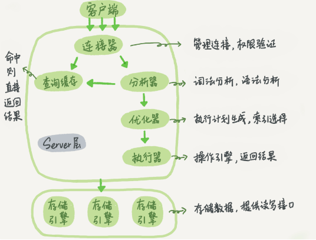
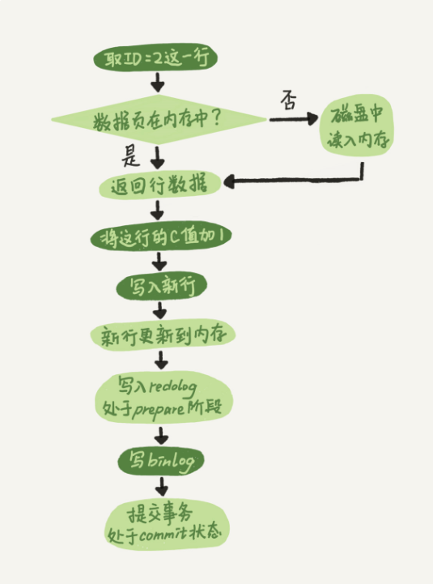

### 基础篇

#### 01｜基础架构：一条SQL查询语句是如何执行的？

* 基础架构

  * 连接器：建立TCP链接之后,进行权限校验,权限校验通过之后,后续的操作便不再校验权限。如果使用短链接，那么频繁建立链接的的代价比较高。如果使用长链接会导致执行语句时所用到的临时内存都管理在链接对象中,这些资源会在链接断开的时候才释放,所以会导致MySql内存占用涨的很快

    解决方案: 

    ​		1)定期断开连接,或者程序中判断经过一次大内存占用的查询后断开连接。

    ​		2)MySQL 5.7 或更新版本，可以在每次执行一个比较大的操作后，通过执行 mysql_reset_connection 来重新初始化连接资源。这个过程不需要重连和重新做权限验证，但是会将连接恢复到刚刚创建完时的状态)。

  * Server层：分析器,优化器,指向器(由于查询缓存在8.0之后整块删除了,所以就不做研究了)

    * 分析器: 对SQL进行词法分析,语法分析
    * 优化器: 经过分析器对Sql的分析校验,对SQL语句进行性能优化
    * 执行器: 判断用户是否具备对该表的查询权限。如果具备查询权限那么将调用存储引擎接口从第一行开始取数据,如果数据符合查询要求就加入结果集

  * 存储引擎：插件式支持Innodb,MyISAM,Memory

    

**SQL_Node**

| Sql                                 | 释义                        |
| ----------------------------------- | --------------------------- |
| mysql -h ip -P port -u user -p      | 远程连接Mysql               |
| show processlist                    | 查看当前Mysql的所有连接信息 |
| show variables like 'wait_timeout'; | 查看默认断开链接时间        |

#### 02｜日志系统：一条SQL更新语句是如何执行的？

* 执行器先从引擎存储指定数据行,如果数据存在内存中那么直接返回给执行器，如果不存在先从磁盘加载到内存,再返回给执行器。

* 执行器对数据进行更新操作之后,调用存储引擎接口写入数据

* 存储引擎将更新操作记录在redo log里，此时redo log的状态为prepare，然后告诉执行器执行完成，可以提交事物

* 执行器生成BinLog,并把binlog写入磁盘

* 执行器调用存储引擎的提交事物接口,将刚刚prepare的redolog修改为提交(commit)，更新完成

  

* redolog与binlog的区别
  * redolog是innbodb独有的存储引擎层日志,存储的是物理页上的修改,采用的是循环写入的方式
  * binlog是mysql通用的Server层日志,存储的是逻辑日志,采用的是追加写
* 为什么需要2阶段提交?为了保证数据一致性
  * 当需要进行数据修复备份或者主从库复制时,如果采用先写一个再写一个的方式会导致以下问题
    * 先写redo再写binlog: redo记录了最新的操作,但是binlog由于cash丢失了该数据,进行数据恢复时使用binlog进行恢复,这就导致了恢复后的数据与redo不一致
    * 先写binlog再写redo: binlog记录了最新的操作,但是redo由于cash丢失了数据,进行数据恢复时使用binlog进行恢复,导致binlog使用最新的数据进行恢复,但是redo中持有的是旧数据,所以数据库还是不一致
* 为什么需要redolog？
  * 如果每次更新都是直接进行磁盘IO的话那么就导致出现大量的随机IO大大降低了性能,如果使用的是redolog,每次在固定的内存块上顺序的记录着各个物理页需要进行的数据修改,那么性能就得到了提升,后续只需要等mysql不那么繁忙的时候将redo上的日志更新至磁盘即可

#### 03｜事物隔离：为什么你改了我还看得见

**ACID:** 原子性,一致性,隔离性,持久性

| 隔离级别 | 释义                                        | 出现的问题                                                   |
| -------- | ------------------------------------------- | ------------------------------------------------------------ |
| 读未提交 | 未提交的事务,所修改的记录可以被其他事务看到 | 脏读: A为提交的事务被B读取到了                               |
| 读已提交 | 提交后的事务,可以被其他事务看到             | 不可重复读: A,B同时开启事物,A对某一条记录修改并提交之后。<br>致使B在同一个事务中对相同的记录读取到的状态并不一致,这个不一致并不是由B的修改而产生的 |
| 可重复读 | 一个事务在执行过程中,看到的数据总是保持一致 | 幻读: 出现在该隔离级别下,为了维护视图的一致性<br>看不到其他事务对数据的新增或者删除,但是其他事务又真实的进行了新增删除操作<br>假设重复在该事务中插入该相同记录,就冲突了,由此产生了幻读 |
| 串行化   | 对同一行记录,读会加读锁,写会加写锁          |                                                              |

* **视图**
  * 读未提交：不需要视图,查看当前记录最新值
  * 读已提交：Sql执行前开启视图
  * 可重复读：开启事务时开启视图
  * 串行化：对记录加锁,不需要视图

**SQL_Node**

| Sql                                 | 释义                                                         |
| ----------------------------------- | ------------------------------------------------------------ |
| show variables like 'tx_isolation'; | 查看数据库事务级别                                           |
| begin                               | 开启事务                                                     |
| start transaction                   | 开启事务                                                     |
| commit                              | 提交                                                         |
| rollback                            | 回滚                                                         |
| set autocommit=0                    | 关闭自动提交,只要执行任务Sql都会开启事务,直到主动执行commit｜rollback |
| set autocommit=1                    | 显示开启事务                                                 |
| commit work and chain               | 提交事务并开启下一个事务,这样就少执行一个begin语句           |

#### 04｜深入浅出索引(上)

```
索引的出现是为了优化查询效率,简要分析不同数据结构索引的特点
1.Hash表结构,查询效率高,接近o(1),插入效率也高。但不足之处就是进行范围查询的时候需要进行全表扫描
2.数组结构,查询效率高,接近o(n),插入效率慢,需要挪动大量元素,但进行范围查询的时候效率高o(logN)
3.二叉树,查询效率不错o(logN),插入效率不错o(logN),范围查询也不错,但劣势在于如果数据量大,树高的时候就不得不进行多次访问数据快(数据存在节点上,想知道是否命中就必须获取节点数据)
4.多叉树,相比于二叉树,树较低,多叉树的树高取决于数据块的大小,综合来说效率良好
```

**innodb存储引擎**

* 数据结构B+树
* 数据存储在主键索引叶子结点上
* 非主键索引的叶子结点存储的是主键索引的值,那么根据非主键索引进行查询,就得查询至少2个索引树(自身及主键索引树),也就是回表
* 页分裂: 
* 页合并:
* 主键索引的选择(自增主键还是业务主键)
  * 业务主键如果长度较大，就会导致二级索引树较大
  * 业务主键很可能会导致非顺序插入,那么会导致写入成本较高(页分裂,页合并)
* 什么时候使用业务主键
  * 没有其他的二级索引
  * 该索引为唯一索引