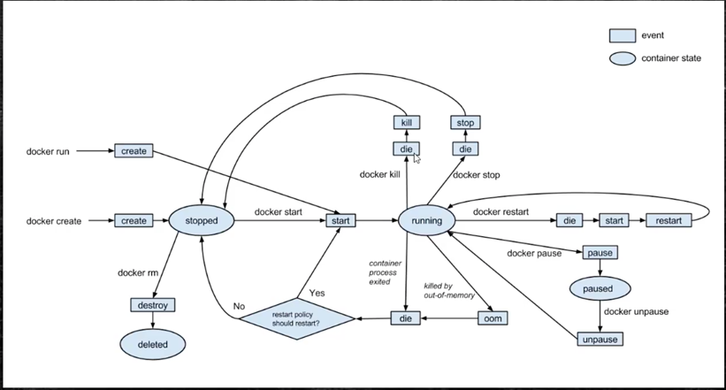

## 容器内部结构

### 在容器中执行命令

* docker exec [-it] 容器Id 命令
  * exec 在容器中执行命令
  * -i:保持终端开启
    * docker exec -it boot2 bash
  * -t：分配终端
  * -e：设置环境变量
    * docker exec -it -e var1=v1 exectest bash
  * -d：后台执行命令
  * -w：进入容器后所在的目录
    * docker exec -it -w /root exectest bash

### 容器生命周期


```
docker kill 和docker stop的差别(在执行后再执行start)
1.kill会重新create新的应用进程
2.stop会重新start旧进程
```

