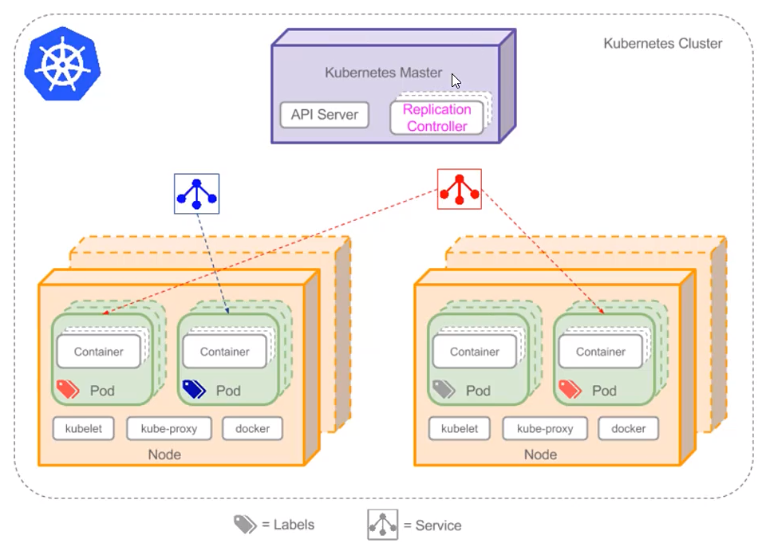

## k8s概念

### 职责

* 自动化容器的部署和复制
* 随时扩展收缩容器规模
* 容器分组Group，并且提供容器间的负载均衡
* 实时监控，即时故障发现，自动替换

### 基本概念

* K8S Master: K8S主节点
  * 整个集群的管理者，所有来自外部的数据包都由master进行接收并分配
* K8S Node: 节点
  * 可以是物理机，也可以是虚拟机
* POD(豆荚)
  * POD是"容器"的容器，可以包含多个container
  * POD是K8S最小可部署单元，一个POD就是一个进程
  * POD内部容器网络互联互通，每个POD都有独立虚拟IP
  * POD都是部署完整的应用或模块
  * Pause
    * 提供一个共享的网络空间(一个POD内的2个container就可以通过Pause进行通信了)
    * 为当前POD提供一个共享的Volume挂载数据卷
* Service: 服务
  * 将多个不同主机上的POD通过Service进行联通，让POD之间进行通信
* Label：标签，相当于POD的别名
* Replication Controller: 复制控制器
  * 控制副本数量
  * 创建POD副本
  * 实时监控POD，剔除失去响应的副本，并创建新的副本