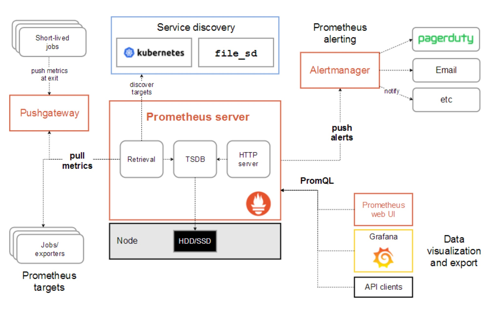

## Prometheus学习资源

* 入门：https://zhuanlan.zhihu.com/p/267966193

* 官方：https://prometheus.io/docs/introduction/overview/

* 查询语法：https://prometheus.io/docs/prometheus/latest/querying/examples/

* SB装配：
  * io.prometheus.client.exporter.HTTPServer
  * io.micrometer.spring.autoconfigure.export.prometheus.PrometheusMetricsExportAutoConfiguration